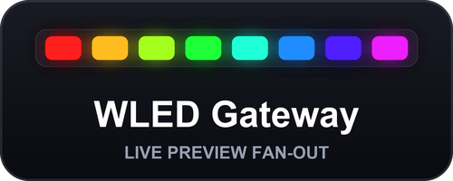
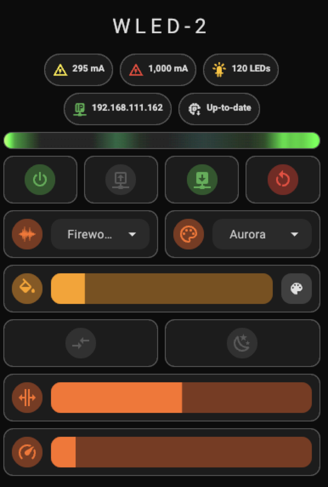
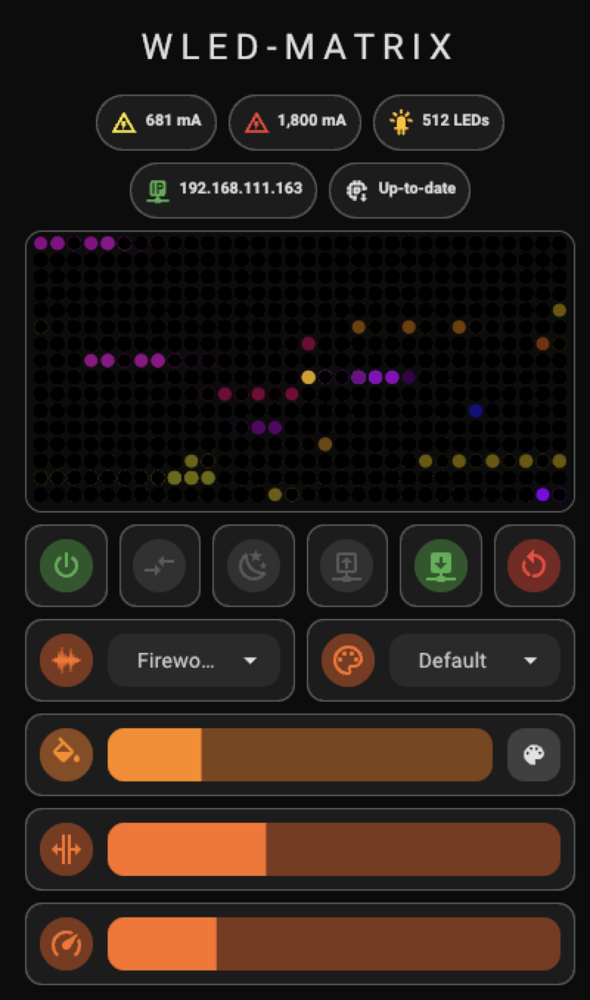
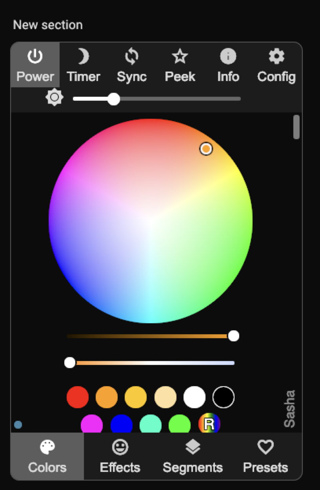
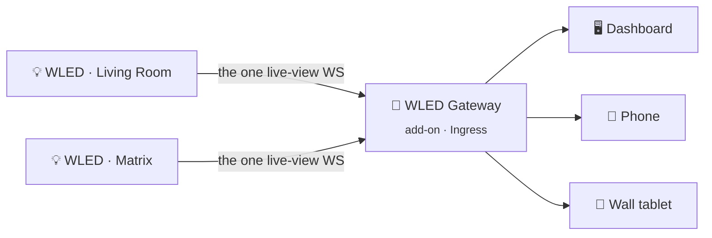

<div align="center">

<h1>
  
</h1>

**A Home Assistant add-on that lets *every* dashboard show a WLED live preview at once.**

[](https://github.com/shuricksumy/wled-gateway-addon/actions/workflows/build.yml)
[](https://www.home-assistant.io/addons/)
[](https://developers.home-assistant.io/docs/add-ons/presentation#ingress)
[](#-published-images)
[](https://github.com/shuricksumy?tab=packages&repo_name=wled-gateway-addon)

&nbsp;&nbsp;&nbsp;&nbsp;

<sub>Live previews and device controls rendered straight into Lovelace — strip, matrix, and the device's own admin UI, embedded.</sub>

</div>

---

## ❓ The problem

WLED's built-in live-preview WebSocket only streams to **whichever client asked for it
most recently**. Open a second dashboard, a second browser tab, or a wall tablet, and it
silently steals the feed from the first one. Watching the same device from more than one
place simply isn't possible.

## ✅ What this does

Holds the **one** live-view connection each WLED device allows and fans it out to as many
viewers as connect — your phone, a wall tablet, and three browser tabs, all at the same
time.



It runs with **Ingress**, so it's reachable through Home Assistant itself — local IP,
local domain, or external tunnel — with no port forwarding, no reverse proxy, and no
extra authentication to set up.

### Also in the box

| | |
| --- | --- |
| 🎛️ **Live preview, 1D and 2D** | A gradient bar for strips, a dot-matrix canvas for panels — embeddable in any Lovelace card. |
| 🔄 **Effect list sync** | Keeps your `input_select` effect dropdowns matched to each device's real, live effect list — no helper automation needed. |
| 🖥️ **Device web UI proxy** | Open or embed each device's own WLED admin interface from inside Home Assistant, without hunting down its IP. |
| 📊 **Live status** | A built-in info page showing every configured device, its connection state, and its ready-to-copy Ingress URLs. |

---

## 🚀 Install

1. In Home Assistant, go to **Settings → Add-ons → Add-on Store**
2. Open the **⋮** menu (top right) → **Repositories**
3. Add this URL:

   ```text
   https://github.com/shuricksumy/wled-gateway-addon
   ```

4. Install **WLED Gateway**, list your devices under **Configuration**, and start it.

Then head to **[the add-on's documentation](wled_gateway/README.md)** for configuration
options, the endpoint reference, and copy-pasteable Lovelace card examples.

> [!TIP]
> Images are prebuilt and published to GHCR, so installing **pulls** the image rather
> than building it on your machine — installs are quick and don't depend on the Docker
> Engine version your Supervisor happens to ship.

---

## 📚 Documentation

| Document | What's in it |
| --- | --- |
| 📖 **[Add-on README](wled_gateway/README.md)** | Configuration, effect sync, endpoints, Lovelace card examples, troubleshooting. |
| 📝 **[Changelog](wled_gateway/CHANGELOG.md)** | Release history. |
| 🛠️ **[Development](DEVELOPMENT.md)** | Running the add-on locally, with a faster loop than a full Supervisor install. |

---

## 🐳 Published images

Built by GitHub Actions and pushed to GHCR on every change to the add-on. Home Assistant
picks the matching one automatically via the `{arch}` placeholder in `config.json`.

| Architecture | Image |
| --- | --- |
| `amd64` | `ghcr.io/shuricksumy/wled-gateway-addon-wled_gateway-amd64` |
| `aarch64` | `ghcr.io/shuricksumy/wled-gateway-addon-wled_gateway-aarch64` |
| `armv7` | `ghcr.io/shuricksumy/wled-gateway-addon-wled_gateway-armv7` |

Every image is tagged both `latest` and with the add-on version.

<details>
<summary><b>How a release works</b></summary>

<br>

1. Bump `version` in [`wled_gateway/config.json`](wled_gateway/config.json) and add a
   [`CHANGELOG.md`](wled_gateway/CHANGELOG.md) entry
2. Push to `main`
3. [The workflow](.github/workflows/build.yml) validates the add-on, then builds all
   three architectures and tags each image `latest` **and** the new version
4. Home Assistant offers the update on the add-on page

It can also be run on demand from **Actions → Build and publish add-on image → Run
workflow**.

</details>

---

## 🤝 Contributing

Issues and pull requests are welcome. The add-on is a single, readable
[`app.py`](wled_gateway/app.py) built on `aiohttp` — see
[DEVELOPMENT.md](DEVELOPMENT.md) to get a local instance running.
