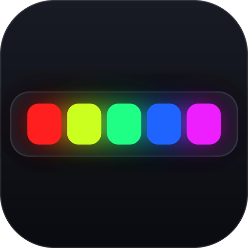
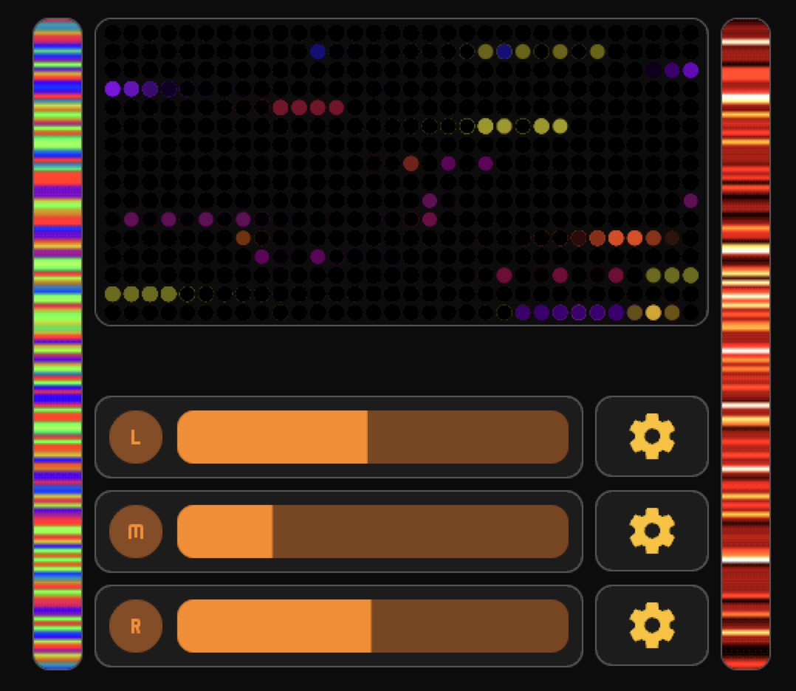

# WLED Gateway

[](https://github.com/shuricksumy/wled-gateway-addon/actions/workflows/build.yml)
[](https://developers.home-assistant.io/docs/add-ons/presentation#ingress)
[](../README.md#-published-images)

[](https://my.home-assistant.io/redirect/supervisor_add_addon_repository/?repository_url=https%3A%2F%2Fgithub.com%2Fshuricksumy%2Fwled-gateway-addon)

WLED's own live-preview WebSocket only streams to whichever client asked for
it most recently — every new viewer steals the feed from the last one. This
add-on holds the one connection each WLED device allows and fans it out to
as many dashboard viewers as connect at once (multiple tabs, multiple
people, a wall tablet plus your phone — all at the same time).

Runs with Ingress enabled, so it's reachable through Home Assistant itself —
local IP, local domain, external tunnel — with no separate networking,
reverse proxy, or port forwarding to set up.

It also keeps any `input_select` effect dropdowns in your dashboard synced
to each device's real, live effect list — no separate automation needed,
and it can proxy each device's own admin web UI so you can open or embed it
directly from Home Assistant for setup and debugging.

See [`CHANGELOG.md`](CHANGELOG.md) for release history, and
[`../DEVELOPMENT.md`](../DEVELOPMENT.md) if you're changing this add-on
yourself and want a faster test loop than a full Supervisor install cycle.

## Configuration

Go to the add-on's **Configuration** tab and list your devices:

```yaml
auto_create_helpers: true
devices:
  - id: "1"
    name: Living Room
    ip: 192.0.2.11
  - id: "2"
    name: Matrix
    ip: 192.0.2.13
```

- `id` — whatever short string you want; it's what you'll reference from
  dashboard card URLs (`?wled=1`). Doesn't need to match anything in Home
  Assistant.
- `name` — for your own reference, not used anywhere functionally yet.
- `ip` — the WLED device's LAN IP.
- `input_select` — optional, and usually unnecessary. Each device defaults to
  `input_select.wled_effect_<id>` (device `6` → `input_select.wled_effect_6`),
  created for you on first connect. Set this only to point a device at a
  helper you already have under a different name.
- `full_brightness_preview` — optional, defaults to `true`. Shows the preview
  at full strength regardless of how far the device is dimmed.
- `preview_brightness` — optional. A fixed percentage that ignores the device's
  brightness entirely (`100` = colours exactly as received). See
  [below](#preview-brightness).
- `auto_create_helpers` — optional, defaults to `true`. Set it to `false` to
  stop the add-on creating helpers, in which case only devices with an
  explicit `input_select` are synced.

Restart the add-on after changing the list.

### Effect helpers are created for you

Add a device, restart, and the matching `input_select` appears in Home
Assistant already populated with that device's real effect list — no helper
to create by hand, no entity id to type in. The id follows straight from the
device id, so device `6` gets `input_select.wled_effect_6`.

Existing helpers are never touched: if the entity is already there, the
add-on just keeps its options in sync as before. Creating helpers needs an
admin token, which add-ons normally have — if yours doesn't, the log says so
and names the helper to create by hand, and everything else keeps working.

## Effect list sync

WLED's own HA integration doesn't expose a native "effect" select entity —
only `light.turn_on` with an `effect:` parameter. A common workaround is an
`input_select` helper (populated with effect names) plus an automation that
applies the chosen value:

```yaml
# automations.yaml — apply the picked effect (one per device)
- alias: Set Effect - Living Room
  triggers:
    - trigger: state
      entity_id: input_select.wled_effect_1
  actions:
    - action: light.turn_on
      target:
        entity_id: light.wled_living_room
      data:
        effect: "{{ states('input_select.wled_effect_1') }}"
  mode: single
```

The `input_select`'s `options` still need to come from somewhere real, or
the dropdown just shows whatever was typed in by hand and drifts out of
date. That's what this add-on now does for you: on connecting (and
reconnecting) to each device, it fetches the device's actual effect list
directly (`GET /json/effects`) and pushes it into the configured
`input_select` via Home Assistant's own API
(`input_select.set_options`) — no automation required for this part.

The helper itself is created the same way if it doesn't exist yet (see
[above](#effect-helpers-are-created-for-you)), so adding a device to the
config is all that's needed to get a working, populated effect dropdown.

This needs the add-on's `homeassistant_api: true` permission (already set
in `config.json`), which gives it a `SUPERVISOR_TOKEN` to call
`http://supervisor/core/api/...` on Home Assistant's behalf.

## Preview brightness

WLED's live view sends pixels **already scaled by the device's master
brightness**, so a strip dimmed to 20% previews at 20% — nearly black on a
dashboard, even though the card is only meant to show what's playing.

By default the add-on scales that back up, so the preview reads at full
strength whatever the device is set to. Colours are preserved: it divides out
the reported brightness rather than just brightening everything. Untick
**Preview at full brightness** on a device to see the strip exactly as it
really looks.

### Or pin it to a constant

If following the device looks uneven, set **Fixed preview brightness %** on the
device and the preview ignores the device's brightness completely:

| Value | Result |
|---|---|
| *(empty)* | Follow the device — scale the preview up as it dims |
| `100` | Exactly the colours as received, no boost at all |
| `175` | The boost this preview used before it followed the device |
| `300`+ | Punchier, for a preview that has to read from across the room |

Per card, the URL wins over the setting:

| Parameter | Effect |
|---|---|
| `&bright=100` | Pin to a constant percentage, ignoring the device |
| `&normalize=0` | True look — preview dims with the device |
| `&normalize=1` | Scale up as the device dims |
| `&gain=1.5` | Extra multiplier on top of whichever mode is active |

```yaml
type: iframe
url: INGRESS/preview?wled=1&bright=100   # this card only
aspect_ratio: 5%
```

**Worth knowing**: at very low brightness the device has already crushed the
colours into a handful of levels before sending them, so scaling back up looks
grainy. Pixels at 1–2 counts are dropped rather than amplified — otherwise a
dimmed strip previews as drifting speckle — and the boost is capped at 8x.
Scaling is applied per pixel as a whole, so a boosted colour keeps its hue
instead of shifting as one channel saturates. It's a dashboard preview, not a
colour-accurate instrument.

## Finding your Ingress URL

Open the add-on's **Web UI** — the add-on's own home page shows exactly the
base path your Lovelace cards need, plus a ready-made preview URL for every
configured device, with a copy button. It's generated fresh on every page
load (via the `X-Ingress-Path` header Supervisor sends), so it's always
correct — open it any time you need the current value, including right
after a reinstall changes the token.

If you'd rather read it straight from the browser: the address bar shows
something like:

```
http://<your-ha-host>:8123/api/hassio_ingress/<token>/
```

The `/api/hassio_ingress/<token>/` part is what your Lovelace cards need.
This token is assigned once per install; if you ever uninstall and
reinstall the add-on, it changes and your card URLs need updating (or see
"Avoiding hardcoded tokens" below to sidestep that entirely).

Because it's a relative, same-origin path, it works identically whether
you're viewing the dashboard on your LAN, through a local domain, or from
outside via an external tunnel — no separate configuration per access
method.

## Avoiding hardcoded tokens in your cards

Since the Ingress token changes if you ever reinstall the add-on, hardcoding
it into every card means updating every card by hand when that happens. If
you have the [config-template-card](https://github.com/iantrich/config-template-card)
HACS card installed, you can make it a single source of truth instead:

1. Add an `input_text` helper to hold the base path:

```yaml
# input_text.yaml (or your own input_texts include)
wled_base_url:
  name: WLED Base URL
  max: 255
  initial: /api/hassio_ingress/your-token-here
```

Create it either by adding that YAML and restarting Home Assistant, or via
**Settings → Devices & Services → Helpers → + Create Helper → Text**, name
it "WLED Base URL", and paste in your current Ingress path (found on this
add-on's own info page) as its value.

2. Wrap each iframe card in `config-template-card`, templating the URL from
   that helper instead of hardcoding it:

```yaml
type: custom:config-template-card
variables:
  WLED_BASE_URL: states['input_text.wled_base_url'].state
entities:
  - input_text.wled_base_url
card:
  type: iframe
  url: ${WLED_BASE_URL + '/preview?wled=1'}
  aspect_ratio: 5%
  title: null
```

Now, whenever the token changes, update the one `input_text` value (via
Developer Tools → States, or its own card) and every card picks it up
automatically — no hunting through dashboards.

## Endpoints

| Path | What it does |
|---|---|
| `/preview?wled=<id>` | Linear preview — a single gradient bar of all LEDs. Good for LED strips. Optional `&rotate=90\|180\|270` to rotate the bar, `&bright=<pct>`, `&normalize=0\|1` and `&gain=<n>` for [brightness](#preview-brightness). |
| `/preview2d?wled=<id>` | 2D preview — a dot-matrix canvas, for matrix/panel devices. Takes the same `&bright` / `&normalize` / `&gain` as above. |
| `/ws/<id>` | Raw relay WebSocket, if you're building your own frontend instead of using the built-in pages. |
| `/json/<id>/live` | Passthrough to the device's own `/json/live` HTTP endpoint. |
| `/devices` | JSON list of configured devices and live connection status, for debugging. |
| `/device/<id>/` | Reverse proxy for the device's own admin web UI — open it directly, or embed it in a card (see below). |

## Device web UI (setup & debugging)

Each device's own WLED admin interface is reachable at `/device/<id>/` —
linked directly from the add-on's info page (the "Open" link per device).
Useful for changing settings, checking logs, or debugging a device without
leaving Home Assistant or hunting down its raw IP.

It can also go straight into a Lovelace card:


```yaml
type: custom:config-template-card
variables:
  WLED_BASE_URL: states['input_text.wled_base_url'].state
entities:
  - input_text.wled_base_url
card:
  type: iframe
  url: ${WLED_BASE_URL + '/device/1'}
  aspect_ratio: 150%
  title: null
```

**Known limitation**: WLED's own web UI wasn't built to run under a URL
sub-path, so if any of its assets or internal API calls use absolute
(leading-slash) paths, those specific requests will miss the proxy. Most of
the interface loads and works fine since it's largely relative-path based;
the most likely thing to not fully work is its own internal WebSocket for
live state updates. If something looks broken, opening the device's raw IP
directly is always the fallback.

## Lovelace card examples

All examples below use synthetic device names/IPs matching the
Configuration example above. Replace `INGRESS` with your actual
`/api/hassio_ingress/<token>` path.

**Basic strip preview**, shown only while the light is on:

```yaml
type: conditional
conditions:
  - entity: light.wled_living_room
    state: "on"
card:
  type: iframe
  url: INGRESS/preview?wled=1
  aspect_ratio: 5%
  title: null
```

**Full strip device card** — live preview plus Home Assistant's own WLED
integration entities (current draw / LED count / IP chips, power / sync /
restart controls, effect + palette selects, brightness/color, intensity and
speed sliders):


```yaml
type: vertical-stack
cards:
  - type: custom:mushroom-title-card
    title: W L E D - LIVING ROOM
    alignment: center
  - type: custom:mushroom-chips-card
    chips:
      - type: entity
        entity: sensor.wled_living_room_estimated_current
        icon: mdi:flash-triangle-outline
      - type: entity
        entity: sensor.wled_living_room_led_count
        icon: mdi:led-on
      - type: entity
        entity: sensor.wled_living_room_ip
        tap_action:
          action: url
          url_path: http://192.0.2.11
    alignment: center
  - type: conditional
    conditions:
      - entity: light.wled_living_room
        state: "on"
    card:
      type: iframe
      url: INGRESS/preview?wled=1
      aspect_ratio: 5%
      title: null
  - square: false
    type: grid
    columns: 4
    cards:
      - type: custom:mushroom-template-card
        icon: mdi:power
        icon_color: >-
          green#5A5A5A
        entity: light.wled_living_room
        tap_action:
          action: toggle
      - type: custom:mushroom-template-card
        icon: mdi:upload-network-outline
        icon_color: >-
          green#5A5A5A
        entity: switch.wled_living_room_sync_send
        tap_action:
          action: call-service
          service: switch.toggle
          target:
            entity_id: switch.wled_living_room_sync_send
      - type: custom:mushroom-template-card
        icon: mdi:download-network
        icon_color: >-
          green#5A5A5A
        entity: switch.wled_living_room_sync_receive
        tap_action:
          action: call-service
          service: switch.toggle
          target:
            entity_id: switch.wled_living_room_sync_receive
      - type: custom:mushroom-template-card
        icon: mdi:restart
        icon_color: red
        entity: button.wled_living_room_restart
  - square: false
    type: grid
    columns: 2
    cards:
      - type: custom:mushroom-select-card
        entity: input_select.wled_effect_1
        icon: mdi:waveform
      - type: custom:mushroom-select-card
        entity: select.wled_living_room_color_palette
  - type: custom:mushroom-light-card
    entity: light.wled_living_room
    show_color_control: true
    show_brightness_control: true
  - square: false
    type: grid
    columns: 1
    cards:
      - type: custom:mushroom-number-card
        entity: number.wled_living_room_intensity
        display_mode: slider
        icon: mdi:arrow-split-vertical
      - type: custom:mushroom-number-card
        entity: number.wled_living_room_speed
        display_mode: slider
        icon: mdi:speedometer
```

**2D matrix device card** — same idea, using `/preview2d` and the
matrix-specific reverse/nightlight switches:


```yaml
type: vertical-stack
cards:
  - type: custom:mushroom-title-card
    title: W L E D - MATRIX
    alignment: center
  - type: custom:mushroom-chips-card
    chips:
      - type: entity
        entity: sensor.wled_matrix_estimated_current
        icon: mdi:flash-triangle-outline
      - type: entity
        entity: sensor.wled_matrix_led_count
        icon: mdi:led-on
      - type: entity
        entity: sensor.wled_matrix_ip
        tap_action:
          action: url
          url_path: http://192.0.2.13
    alignment: center
  - type: conditional
    conditions:
      - entity: light.wled_matrix
        state: "on"
    card:
      type: iframe
      url: INGRESS/preview2d?wled=3
      aspect_ratio: 51%
      title: null
  - square: false
    type: grid
    columns: 6
    cards:
      - type: custom:mushroom-template-card
        icon: mdi:power
        icon_color: >-
          green#5A5A5A
        entity: light.wled_matrix
        tap_action:
          action: toggle
      - type: custom:mushroom-template-card
        icon: mdi:compare-horizontal
        icon_color: >-
          green#5A5A5A
        entity: switch.wled_matrix_reverse
        tap_action:
          action: call-service
          service: switch.toggle
          target:
            entity_id: switch.wled_matrix_reverse
      - type: custom:mushroom-template-card
        icon: mdi:weather-night
        icon_color: >-
          green#5A5A5A
        entity: switch.wled_matrix_nightlight
        tap_action:
          action: call-service
          service: switch.toggle
          target:
            entity_id: switch.wled_matrix_nightlight
      - type: custom:mushroom-template-card
        icon: mdi:upload-network-outline
        icon_color: >-
          green#5A5A5A
        entity: switch.wled_matrix_sync_send
        tap_action:
          action: call-service
          service: switch.toggle
          target:
            entity_id: switch.wled_matrix_sync_send
      - type: custom:mushroom-template-card
        icon: mdi:download-network
        icon_color: >-
          green#5A5A5A
        entity: switch.wled_matrix_sync_receive
        tap_action:
          action: call-service
          service: switch.toggle
          target:
            entity_id: switch.wled_matrix_sync_receive
      - type: custom:mushroom-template-card
        icon: mdi:restart
        icon_color: red
        entity: button.wled_matrix_restart
  - square: false
    type: grid
    columns: 2
    cards:
      - type: custom:mushroom-select-card
        entity: input_select.wled_effect_matrix
        icon: mdi:waveform
      - type: custom:mushroom-select-card
        entity: select.wled_matrix_color_palette
  - type: custom:mushroom-light-card
    entity: light.wled_matrix
    show_color_control: true
    show_brightness_control: true
  - square: false
    type: grid
    columns: 1
    cards:
      - type: custom:mushroom-number-card
        entity: number.wled_matrix_intensity
        display_mode: slider
        icon: mdi:arrow-split-vertical
      - type: custom:mushroom-number-card
        entity: number.wled_matrix_speed
        display_mode: slider
        icon: mdi:speedometer
```

**Rotated strip card** (e.g. a vertical strip mounted on a wall, wired as
device id 4) — compact wall-panel style: the rotated preview as one card,
plus a separate light card next to it in the same section.

Preview card:

```yaml
type: horizontal-stack
cards:
  - type: iframe
    url: INGRESS/preview?wled=4&rotate=270
    title: null
grid_options:
  columns: 1
  rows: 7
```

Light card, placed alongside it in the same grid section:

```yaml
type: custom:mushroom-light-card
entity: light.wled_strip_left
show_color_control: false
show_brightness_control: true
icon: mdi:alpha-l
grid_options:
  columns: 8
  rows: 1
```

## Full-height vertical strip (advanced)

The rotated preview above still sizes itself by `aspect_ratio` (a
percentage of its own width), not by the actual height of its grid cell —
fine for a short bar, but it won't stretch to fill a tall narrow column on
its own. If you have [card-mod](https://github.com/thomasloven/lovelace-card-mod)
installed, you can force it to fill the cell by height instead, using a
fixed pixel value:

```yaml
type: horizontal-stack
cards:
  - type: custom:config-template-card
    variables:
      WLED_BASE_URL: states['input_text.wled_base_url'].state
    entities:
      - input_text.wled_base_url
    card:
      type: iframe
      url: ${WLED_BASE_URL + '/preview?wled=4&rotate=270'}
      title: null
      card_mod:
        style: |
          ha-card > div {
            padding-top: 0 !important;
            height: 440px !important;
            position: relative;
          }
          iframe {
            position: absolute;
            inset: 0;
            width: 100%;
            height: 100%;
          }
grid_options:
  columns: 1
  rows: 7
```

`ha-card > div` is the element the built-in iframe card uses for its
aspect-ratio padding trick — zeroing its `padding-top` and giving it a
concrete height is what breaks it out of ratio-based sizing. The trade-off:
`440px` is a fixed value, not tied to the grid's actual row height, so it
won't auto-resize if your layout or screen size changes — tune the number
to taste. A full example combining two of these (flanking a media player
card) with a 2D matrix preview and light-card/gear-button widgets for each
device below:



```yaml
type: grid
cards:
  - type: horizontal-stack
    cards:
      - type: custom:config-template-card
        variables:
          WLED_BASE_URL: states['input_text.wled_base_url'].state
        entities:
          - input_text.wled_base_url
        card:
          type: iframe
          url: ${WLED_BASE_URL + '/preview?wled=4&rotate=270'}
          title: null
          card_mod:
            style: |
              ha-card > div {
                padding-top: 0 !important;
                height: 440px !important;
                position: relative;
              }
              iframe {
                position: absolute;
                inset: 0;
                width: 100%;
                height: 100%;
              }
    grid_options:
      columns: 1
      rows: 7
  - type: horizontal-stack
    cards:
      - type: custom:config-template-card
        variables:
          WLED_BASE_URL: states['input_text.wled_base_url'].state
        entities:
          - input_text.wled_base_url
        card:
          type: iframe
          url: ${WLED_BASE_URL + '/preview2d?wled=3'}
          aspect_ratio: 50%
          title: null
    grid_options:
      rows: 4
      columns: 10
  - type: horizontal-stack
    cards:
      - type: custom:config-template-card
        variables:
          WLED_BASE_URL: states['input_text.wled_base_url'].state
        entities:
          - input_text.wled_base_url
        card:
          type: iframe
          url: ${WLED_BASE_URL + '/preview?wled=5&rotate=270'}
          title: null
          card_mod:
            style: |
              ha-card > div {
                padding-top: 0 !important;
                height: 440px !important;
                position: relative;
              }
              iframe {
                position: absolute;
                inset: 0;
                width: 100%;
                height: 100%;
              }
    grid_options:
      columns: 1
      rows: 7
  - type: custom:mushroom-light-card
    entity: light.wled_strip_left
    show_color_control: false
    primary_info: none
    icon: mdi:alpha-l
    layout: horizontal
    collapsible_controls: true
    use_light_color: true
    show_brightness_control: true
    show_color_temp_control: false
    secondary_info: none
    hold_action:
      action: more-info
    tap_action:
      action: toggle
    grid_options:
      columns: 8
      rows: 1
  - type: horizontal-stack
    cards:
      - type: custom:button-card
        entity: light.wled_strip_left
        icon: mdi:cog
        show_name: false
        tap_action:
          action: more-info
        layout: vertical
        size: 50%
        styles:
          card:
            - height: 55px
    grid_options:
      columns: 2
      rows: 1
```

(repeat the light-card + gear-button pair for the matrix and the right
strip, matching their own entities)

## Troubleshooting

- **Iframe shows a blank card / "unable to load iframes... http:"** — this
  happens if you hardcode an `http://` address instead of the relative
  Ingress path. Always use the `/api/hassio_ingress/<token>/...` form, never
  a raw container IP:port, so it works over both http and https.
- **Preview never lights up** — check the add-on's log for `upstream
  connected: <id> (<ip>)` on startup. If it's missing or retrying, the
  device's IP in Configuration is wrong or it's unreachable.
- **Card 404s after reinstalling the add-on** — the Ingress token changed;
  grab the new one from the Web UI and update your card URLs.
- **Effect dropdown never populates** — check the add-on's log for `synced
  N effects to input_select...`. If you instead see `HA set_options
  failed`, confirm the `input_select` entity ID in Configuration is exactly
  right and that `homeassistant_api: true` is present in the installed
  version's `config.json`.
